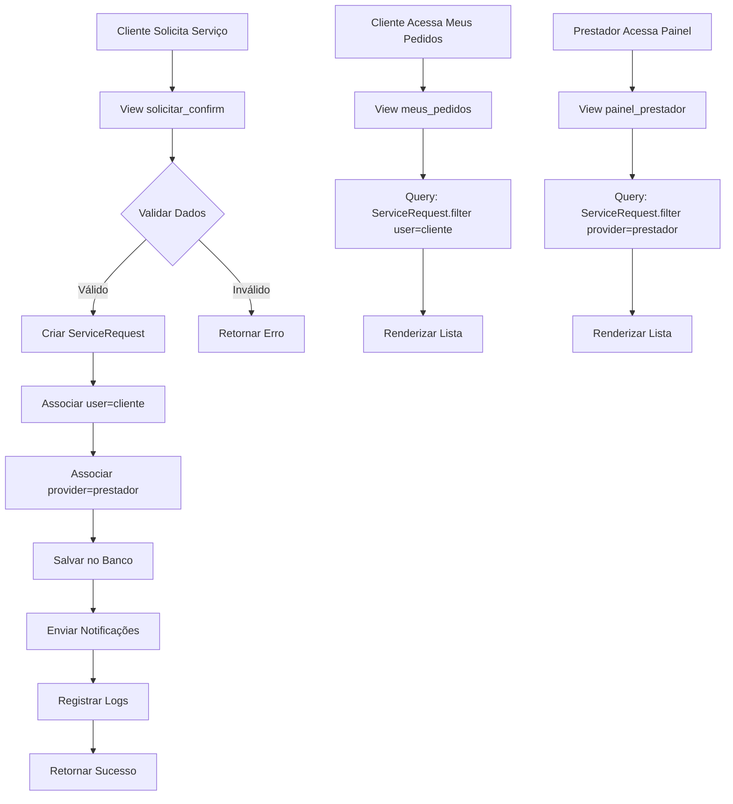

# Design Document - Correção do Fluxo de Solicitação de Serviços

## Overview

Este documento detalha o design técnico para corrigir o problema crítico onde solicitações de serviço não aparecem em "Meus Pedidos" para o cliente nem no painel do prestador. A solução garante que:

1. **Dados sejam salvos corretamente** no banco de dados
2. **Associações corretas** entre cliente, prestador e serviço
3. **Exibição funcional** em ambas as interfaces (cliente e prestador)
4. **Notificações enviadas** para ambas as partes
5. **Logs detalhados** para diagnóstico de problemas

### Problema Identificado

O fluxo atual de solicitação tem as seguintes falhas:
- Solicitações não são persistidas no banco de dados
- Falta associação correta com o prestador de serviço
- Views de "Meus Pedidos" não consultam dados corretamente
- Painel do prestador não filtra solicitações recebidas
- Sistema de notificações não está funcionando

### Solução Proposta

Implementar correções em 3 camadas:
1. **Backend**: Garantir salvamento correto no banco
2. **Views**: Implementar queries corretas para exibição
3. **Templates**: Exibir dados de forma clara e organizada

## Architecture

### Fluxo de Dados Corrigido



### Componentes Críticos a Corrigir

1. **View de Confirmação** (`solicitar_confirm`)
   - Deve criar objeto ServiceRequest com todos os campos
   - Deve associar corretamente user (cliente) e provider (prestador)
   - Deve salvar no banco de dados
   - Deve enviar notificações

2. **View Meus Pedidos** (`meus_pedidos`)
   - Deve filtrar ServiceRequest.objects.filter(user=request.user)
   - Deve ordenar por data de criação (mais recentes primeiro)
   - Deve passar dados corretos para o template

3. **View Painel Prestador** (`painel_prestador`)
   - Deve filtrar ServiceRequest.objects.filter(provider=prestador)
   - Deve permitir filtros por status
   - Deve exibir dados completos do cliente

4. **Modelo ServiceRequest**
   - Deve ter campo `provider` (ForeignKey para User ou Provider)
   - Deve ter campo `user` (ForeignKey para User - cliente)
   - Deve ter todos os campos necessários para agendamento

## Components and Interfaces

### 1. View de Confirmação (solicitar_confirm)

**Responsabilidade**: Salvar solicitação no banco de dados

```python
@login_required
def solicitar_confirm(request):
    if request.method == 'POST':
        try:
            # Recuperar dados da sessão
            session_data = request.session.get('service_request_data', {})
            
            # CRÍTICO: Identificar o prestador corretamente
            service_id = session_data.get('service_id')
            service = CustomService.objects.get(id=service_id)
            provider = service.user  # ou service.provider, dependendo do modelo
            
            # Criar ServiceRequest
            service_request = ServiceRequest.objects.create(
                user=request.user,  # Cliente
                provider=provider,  # Prestador
                service=service,
                service_name=session_data.get('service_name'),
                service_description=session_data.get('description'),
                contact_name=session_data.get('contact_name'),
                contact_phone=session_data.get('contact_phone'),
                contact_email=session_data.get('contact_email'),
                notes=session_data.get('notes', ''),
                preferred_date=session_data.get('preferred_date'),
                preferred_time=session_data.get('preferred_time'),
                address=session_data.get('address'),
                reference_point=session_data.get('reference_point', ''),
                payment_method=session_data.get('payment_method'),
                payment_notes=session_data.get('payment_notes', ''),
                status='pending',
                ip_address=get_client_ip(request),
            )
            
            # Enviar notificações
            send_client_notification(service_request)
            send_provider_notification(service_request)
            
            # Marcar como notificado
            service_request.client_notified = True
            service_request.provider_notified = True
            service_request.save()
            
            # Limpar sessão
            del request.session['service_request_data']
            
            # Log
            logger.info(f"ServiceRequest {service_request.id} criado com sucesso")
            
            return JsonResponse({'success': True, 'request_id': service_request.id})
            
        except Exception as e:
            logger.error(f"Erro ao criar ServiceRequest: {str(e)}")
            return JsonResponse({'success': False, 'error': str(e)}, status=400)
```

### 2. View Meus Pedidos (meus_pedidos)

**Responsabilidade**: Exibir solicitações do cliente

```python
@login_required
def meus_pedidos(request):
    # Filtrar solicitações do usuário logado (cliente)
    solicitacoes = ServiceRequest.objects.filter(
        user=request.user
    ).select_related('provider', 'service').order_by('-created_at')
    
    # Filtros opcionais
    status_filter = request.GET.get('status')
    if status_filter:
        solicitacoes = solicitacoes.filter(status=status_filter)
    
    context = {
        'solicitacoes': solicitacoes,
        'total': solicitacoes.count(),
        'pendentes': solicitacoes.filter(status='pending').count(),
        'confirmadas': solicitacoes.filter(status='confirmed').count(),
    }
    
    return render(request, 'services/meus_pedidos.html', context)
```

### 3. View Painel Prestador (painel_prestador)

**Responsabilidade**: Exibir solicitações recebidas pelo prestador

```python
@login_required
def painel_prestador(request):
    # Verificar se usuário é prestador
    if not hasattr(request.user, 'provider_profile'):
        return redirect('home')
    
    # Filtrar solicitações recebidas pelo prestador
    solicitacoes = ServiceRequest.objects.filter(
        provider=request.user
    ).select_related('user', 'service').order_by('-created_at')
    
    # Filtros
    status_filter = request.GET.get('status', 'pending')
    if status_filter:
        solicitacoes = solicitacoes.filter(status=status_filter)
    
    context = {
        'solicitacoes': solicitacoes,
        'total': ServiceRequest.objects.filter(provider=request.user).count(),
        'pendentes': ServiceRequest.objects.filter(provider=request.user, status='pending').count(),
        'confirmadas': ServiceRequest.objects.filter(provider=request.user, status='confirmed').count(),
    }
    
    return render(request, 'services/painel_prestador.html', context)
```

### 4. Template Meus Pedidos

**Arquivo**: `templates/services/meus_pedidos.html`

```html
<div class="container">
    <h2>Meus Pedidos</h2>
    
    
        <div class="list-group">
            
            <div class="list-group-item">
                <h5>{{ solicitacao.service_name }}</h5>
                <p><strong>Prestador:</strong> {{ solicitacao.provider.get_full_name }}</p>
                <p><strong>Data:</strong> {{ solicitacao.preferred_date }} às {{ solicitacao.preferred_time }}</p>
                <p><strong>Status:</strong> 
                    <span class="badge bg-{{ solicitacao.status|status_color }}">
                        {{ solicitacao.get_status_display }}
                    </span>
                </p>
                <p><strong>Endereço:</strong> {{ solicitacao.address }}</p>
                <a href="" class="btn btn-sm btn-primary">
                    Ver Detalhes
                </a>
            </div>
            
        </div>
    
        <p>Você ainda não fez nenhuma solicitação de serviço.</p>
    
</div>
```

### 5. Template Painel Prestador

**Arquivo**: `templates/services/painel_prestador.html`

```html
<div class="container">
    <h2>Solicitações Recebidas</h2>
    
    <ul class="nav nav-tabs mb-3">
        <li class="nav-item">
            <a class="nav-link active" 
               href="?status=pending">Pendentes ({{ pendentes }})</a>
        </li>
        <li class="nav-item">
            <a class="nav-link active" 
               href="?status=confirmed">Confirmadas ({{ confirmadas }})</a>
        </li>
    </ul>
    
    
        <div class="list-group">
            
            <div class="list-group-item">
                <h5>{{ solicitacao.service_name }}</h5>
                <p><strong>Cliente:</strong> {{ solicitacao.contact_name }}</p>
                <p><strong>Telefone:</strong> {{ solicitacao.contact_phone }}</p>
                <p><strong>Data:</strong> {{ solicitacao.preferred_date }} às {{ solicitacao.preferred_time }}</p>
                <p><strong>Endereço:</strong> {{ solicitacao.address }}</p>
                <p><strong>Descrição:</strong> {{ solicitacao.service_description }}</p>
                
                
                <div class="btn-group">
                    <a href="" class="btn btn-success">
                        Confirmar
                    </a>
                    <a href="" class="btn btn-danger">
                        Rejeitar
                    </a>
                </div>
                
            </div>
            
        </div>
    
        <p>Nenhuma solicitação encontrada.</p>
    
</div>
```

### 6. Sistema de Notificações

**Função para enviar email ao cliente:**

```python
def send_client_notification(service_request):
    subject = f"Solicitação de Serviço Confirmada - {service_request.service_name}"
    message = f"""
    Olá {service_request.contact_name},
    
    Sua solicitação de serviço foi recebida com sucesso!
    
    Serviço: {service_request.service_name}
    Prestador: {service_request.provider.get_full_name()}
    Data: {service_request.preferred_date}
    Horário: {service_request.preferred_time}
    
    O prestador foi notificado e entrará em contato em breve.
    
    Você pode acompanhar o status em "Meus Pedidos".
    """
    
    send_mail(
        subject,
        message,
        settings.DEFAULT_FROM_EMAIL,
        [service_request.contact_email],
        fail_silently=False,
    )
```

**Função para enviar email ao prestador:**

```python
def send_provider_notification(service_request):
    subject = f"Nova Solicitação de Serviço - {service_request.service_name}"
    message = f"""
    Olá {service_request.provider.get_full_name()},
    
    Você recebeu uma nova solicitação de serviço!
    
    Cliente: {service_request.contact_name}
    Telefone: {service_request.contact_phone}
    Serviço: {service_request.service_name}
    Data: {service_request.preferred_date}
    Horário: {service_request.preferred_time}
    Endereço: {service_request.address}
    
    Acesse seu painel para confirmar ou rejeitar a solicitação.
    """
    
    send_mail(
        subject,
        message,
        settings.DEFAULT_FROM_EMAIL,
        [service_request.provider.email],
        fail_silently=False,
    )
```

## Data Models

### ServiceRequest (Modelo Corrigido)

**Campos Essenciais que DEVEM existir:**

```python
class ServiceRequest(models.Model):
    # CRÍTICO: Associações corretas
    user = models.ForeignKey(User, on_delete=models.CASCADE, related_name='service_requests')  # Cliente
    provider = models.ForeignKey(User, on_delete=models.CASCADE, related_name='received_requests')  # Prestador
    service = models.ForeignKey('CustomService', null=True, blank=True, on_delete=models.SET_NULL)
    
    # Dados básicos
    service_name = models.CharField(max_length=200)
    service_description = models.TextField()
    estimated_price = models.DecimalField(max_digits=10, decimal_places=2, null=True, blank=True)
    
    # Dados do cliente
    contact_name = models.CharField(max_length=100)
    contact_phone = models.CharField(max_length=20)
    contact_email = models.EmailField()
    notes = models.TextField(blank=True)
    
    # Dados de agendamento
    preferred_date = models.DateField()
    preferred_time = models.TimeField()
    address = models.TextField()
    reference_point = models.CharField(max_length=200, blank=True)
    
    # Dados de pagamento
    payment_method = models.CharField(max_length=20, choices=[
        ('cash', 'Dinheiro'),
        ('card', 'Cartão'),
        ('pix', 'PIX'),
        ('transfer', 'Transferência')
    ])
    payment_notes = models.TextField(blank=True)
    
    # Status
    status = models.CharField(max_length=20, choices=[
        ('pending', 'Pendente'),
        ('confirmed', 'Confirmado'),
        ('in_progress', 'Em Andamento'),
        ('completed', 'Concluído'),
        ('cancelled', 'Cancelado')
    ], default='pending')
    
    # Metadados
    created_at = models.DateTimeField(auto_now_add=True)
    updated_at = models.DateTimeField(auto_now=True)
    ip_address = models.GenericIPAddressField(null=True, blank=True)
    
    # Notificações
    client_notified = models.BooleanField(default=False)
    provider_notified = models.BooleanField(default=False)
    
    class Meta:
        ordering = ['-created_at']
        indexes = [
            models.Index(fields=['user', '-created_at']),
            models.Index(fields=['provider', '-created_at']),
            models.Index(fields=['status']),
        ]
    
    def __str__(self):
        return f"{self.service_name} - {self.contact_name} ({self.status})"
```

### Verificação do Modelo Existente

Antes de implementar, precisamos verificar:
1. Se o modelo ServiceRequest já existe
2. Se tem o campo `provider` (crítico!)
3. Se tem o campo `user` (cliente)
4. Quais campos estão faltando
5. Se precisa de migration

## Error Handling e Logging

### Tratamento de Erros Críticos

```python
import logging

logger = logging.getLogger(__name__)

def solicitar_confirm(request):
    if request.method == 'POST':
        try:
            # Código de criação do ServiceRequest
            ...
            
        except CustomService.DoesNotExist:
            logger.error(f"Serviço não encontrado: {service_id}")
            return JsonResponse({
                'success': False, 
                'error': 'Serviço não encontrado'
            }, status=404)
            
        except KeyError as e:
            logger.error(f"Dados faltando na sessão: {str(e)}")
            return JsonResponse({
                'success': False, 
                'error': 'Dados incompletos. Reinicie o processo.'
            }, status=400)
            
        except Exception as e:
            logger.error(f"Erro ao criar ServiceRequest: {str(e)}", exc_info=True)
            return JsonResponse({
                'success': False, 
                'error': 'Erro ao processar solicitação. Tente novamente.'
            }, status=500)
```

### Logging Detalhado

```python
# No início da view solicitar_confirm
logger.info(f"Iniciando criação de ServiceRequest para user={request.user.id}")

# Após criar ServiceRequest
logger.info(f"ServiceRequest {service_request.id} criado: "
           f"cliente={service_request.user.id}, "
           f"prestador={service_request.provider.id}, "
           f"serviço={service_request.service_name}")

# Após enviar notificações
logger.info(f"Notificações enviadas para ServiceRequest {service_request.id}")

# Em caso de erro
logger.error(f"Falha ao criar ServiceRequest: {str(e)}", 
            extra={'user_id': request.user.id, 'session_data': session_data})
```

### Validação de Dados

```python
def validate_service_request_data(data):
    """Valida dados antes de criar ServiceRequest"""
    errors = []
    
    required_fields = [
        'service_id', 'service_name', 'contact_name', 
        'contact_phone', 'contact_email', 'preferred_date', 
        'preferred_time', 'address', 'payment_method'
    ]
    
    for field in required_fields:
        if not data.get(field):
            errors.append(f"Campo obrigatório: {field}")
    
    # Validar formato de email
    if data.get('contact_email'):
        import re
        if not re.match(r'^[\w\.-]+@[\w\.-]+\.\w+$', data['contact_email']):
            errors.append("Email inválido")
    
    # Validar data não está no passado
    if data.get('preferred_date'):
        from datetime import date
        if data['preferred_date'] < date.today():
            errors.append("Data não pode ser no passado")
    
    return errors
```

## Testing Strategy

### Testes Críticos de Persistência

#### Teste 1: Salvamento no Banco
1. **Criar solicitação** através do fluxo completo
2. **Verificar no banco**: `ServiceRequest.objects.filter(user=cliente).exists()`
3. **Validar campos**: Todos os dados foram salvos corretamente
4. **Verificar associações**: `user` e `provider` estão corretos

#### Teste 2: Exibição em Meus Pedidos
1. **Cliente faz solicitação**
2. **Acessar** página "Meus Pedidos"
3. **Verificar**: Solicitação aparece na lista
4. **Validar dados**: Informações exibidas estão corretas

#### Teste 3: Exibição no Painel do Prestador
1. **Cliente solicita serviço** de um prestador específico
2. **Prestador acessa** seu painel
3. **Verificar**: Solicitação aparece na lista de pendentes
4. **Validar dados**: Informações do cliente estão corretas

#### Teste 4: Notificações
1. **Criar solicitação**
2. **Verificar**: Email enviado ao cliente
3. **Verificar**: Email enviado ao prestador
4. **Validar**: Flags `client_notified` e `provider_notified` = True

### Queries de Diagnóstico

```python
# Verificar se solicitações estão sendo criadas
ServiceRequest.objects.all().count()

# Ver últimas solicitações
ServiceRequest.objects.all().order_by('-created_at')[:5]

# Verificar solicitações de um cliente específico
ServiceRequest.objects.filter(user__email='cliente@example.com')

# Verificar solicitações para um prestador específico
ServiceRequest.objects.filter(provider__email='prestador@example.com')

# Verificar solicitações sem prestador (problema!)
ServiceRequest.objects.filter(provider__isnull=True)

# Verificar solicitações sem cliente (problema!)
ServiceRequest.objects.filter(user__isnull=True)
```

### Checklist de Validação

- [ ] ServiceRequest é criado no banco de dados
- [ ] Campo `user` aponta para o cliente correto
- [ ] Campo `provider` aponta para o prestador correto
- [ ] Todos os campos obrigatórios estão preenchidos
- [ ] Solicitação aparece em "Meus Pedidos" do cliente
- [ ] Solicitação aparece no painel do prestador
- [ ] Email é enviado ao cliente
- [ ] Email é enviado ao prestador
- [ ] Logs são registrados corretamente
- [ ] Não há erros no console do navegador
- [ ] Não há erros nos logs do Django

## Implementation Priority

### Fase 1: Diagnóstico (CRÍTICO - 1 hora)
1. **Verificar modelo ServiceRequest** existente
2. **Identificar campos faltantes** (especialmente `provider`)
3. **Verificar views** de confirmação e listagem
4. **Analisar templates** de exibição
5. **Revisar logs** para identificar erros

### Fase 2: Correção do Modelo (CRÍTICO - 2 horas)
1. **Adicionar campo `provider`** se não existir
2. **Criar migration** para atualizar banco
3. **Executar migration** em desenvolvimento
4. **Testar criação** de ServiceRequest manualmente
5. **Validar associações** user e provider

### Fase 3: Correção das Views (CRÍTICO - 3 horas)
1. **Corrigir view `solicitar_confirm`** para salvar corretamente
2. **Implementar view `meus_pedidos`** com query correto
3. **Implementar view `painel_prestador`** com query correto
4. **Adicionar logging** detalhado em todas as views
5. **Testar fluxo completo** de ponta a ponta

### Fase 4: Correção dos Templates (2 horas)
1. **Criar/corrigir template** `meus_pedidos.html`
2. **Criar/corrigir template** `painel_prestador.html`
3. **Adicionar filtros** por status
4. **Implementar paginação** se necessário
5. **Testar exibição** em diferentes resoluções

### Fase 5: Sistema de Notificações (2 horas)
1. **Implementar função** `send_client_notification`
2. **Implementar função** `send_provider_notification`
3. **Configurar templates** de email
4. **Testar envio** de emails
5. **Adicionar fallback** em caso de falha

### Fase 6: Testes e Validação (2 horas)
1. **Teste completo** do fluxo de solicitação
2. **Verificar persistência** no banco
3. **Validar exibição** em ambas as interfaces
4. **Testar notificações**
5. **Revisar logs** para garantir ausência de erros

## Technical Decisions

### Por que o Campo `provider` é Crítico?

O campo `provider` no modelo ServiceRequest é essencial porque:
- **Associação Correta**: Vincula a solicitação ao prestador que oferece o serviço
- **Filtragem no Painel**: Permite que o prestador veja apenas suas solicitações
- **Notificações**: Identifica para quem enviar a notificação
- **Relatórios**: Permite análise de demanda por prestador

**Sem este campo, as solicitações ficam "órfãs" e não aparecem no painel do prestador.**

### Como Identificar o Prestador Corretamente?

Existem duas abordagens possíveis:

**Opção 1: Através do serviço (CustomService)**
```python
service = CustomService.objects.get(id=service_id)
provider = service.user  # ou service.provider
```

**Opção 2: Através do perfil do prestador**
```python
service = CustomService.objects.get(id=service_id)
provider = service.provider_profile.user
```

A escolha depende da estrutura do modelo CustomService existente.

### Por que Usar `related_name` nos ForeignKeys?

```python
user = models.ForeignKey(User, related_name='service_requests')
provider = models.ForeignKey(User, related_name='received_requests')
```

Isso permite queries mais intuitivas:
- `user.service_requests.all()` - Solicitações feitas pelo cliente
- `user.received_requests.all()` - Solicitações recebidas pelo prestador

Sem `related_name`, ambos usariam `servicerequest_set`, causando conflito.

### Por que Logging Detalhado?

Logs são essenciais para diagnosticar problemas:
- **Rastreamento**: Identificar onde o processo falha
- **Debugging**: Ver valores de variáveis em produção
- **Auditoria**: Histórico de todas as operações
- **Monitoramento**: Detectar padrões de erro

### Por que Índices no Banco de Dados?

```python
indexes = [
    models.Index(fields=['user', '-created_at']),
    models.Index(fields=['provider', '-created_at']),
]
```

Melhora performance das queries mais comuns:
- Listar solicitações do cliente (ordenadas por data)
- Listar solicitações do prestador (ordenadas por data)
- Filtrar por status

## Success Criteria

A correção será considerada bem-sucedida quando:

### Critérios Críticos (OBRIGATÓRIOS)
1. ✅ **ServiceRequest é criado** no banco de dados ao confirmar solicitação
2. ✅ **Campo `user`** aponta corretamente para o cliente
3. ✅ **Campo `provider`** aponta corretamente para o prestador
4. ✅ **Solicitação aparece** em "Meus Pedidos" do cliente
5. ✅ **Solicitação aparece** no painel do prestador
6. ✅ **Notificação enviada** ao cliente por email
7. ✅ **Notificação enviada** ao prestador por email
8. ✅ **Logs registrados** sem erros

### Critérios Secundários (DESEJÁVEIS)
9. ✅ **Filtros por status** funcionando em ambas as interfaces
10. ✅ **Detalhes completos** exibidos corretamente
11. ✅ **Ações do prestador** (confirmar/rejeitar) funcionando
12. ✅ **Paginação** implementada se houver muitas solicitações
13. ✅ **Interface responsiva** em dispositivos móveis

### Validação Final

**Teste de Aceitação:**
1. Cliente faz solicitação de serviço
2. Cliente acessa "Meus Pedidos" e vê a solicitação
3. Prestador acessa painel e vê a solicitação
4. Ambos recebem emails de notificação
5. Prestador pode confirmar ou rejeitar
6. Status é atualizado em tempo real

**Queries de Verificação:**
```python
# Deve retornar a solicitação criada
ServiceRequest.objects.filter(user=cliente, provider=prestador).exists()

# Deve retornar True
ServiceRequest.objects.filter(user=cliente).count() > 0

# Deve retornar True
ServiceRequest.objects.filter(provider=prestador).count() > 0
```